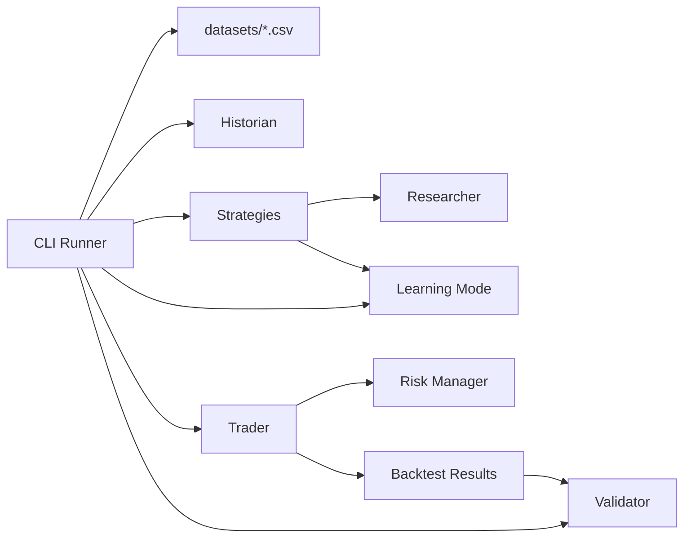

# Architecture

PTB-1 is organized around small modules with one responsibility each.

Every feature proposal must answer:

Does this improve PTB-1's ability to discover or validate trading strategies?

If the answer is no, do not implement it.

## Current Runtime Flow



## Dataset Storage

Historical datasets live in `datasets/` as plain CSV files.

Each CSV uses this format:

```csv
symbol,date,open,high,low,close,volume
```

Dataset names come from filenames without `.csv`.

## Employees

### Historian

Module: `ptb1/historian.py`

Responsibilities:

- Load historical data.
- Maintain historical datasets.

Must not:

- Perform trading logic.
- Generate signals.
- Calculate strategy performance.

### Researcher

Module: `ptb1/researcher.py`

Responsibilities:

- Define strategy signals.
- Define the shared strategy interface.

Must not:

- Execute trades.
- Size positions.
- Calculate portfolio results.

### Strategies

Module: `ptb1/strategies.py`

Responsibilities:

- Implement independent research strategies.
- Expose the explicit strategy registry.
- Provide static education metadata.

Must not:

- Execute trades.
- Calculate performance metrics.
- Load datasets.
- Know dataset names.

### Learning Mode

Module: `ptb1/learning.py`

Responsibilities:

- Provide plain-English strategy education.
- Provide glossary entries.
- Provide template-based explanations from static metadata or measured metrics.

Must not:

- Place trades.
- Change strategies.
- Change parameters.
- Modify research results.
- Modify risk rules.
- Influence trading or backtest decisions.

### Trader

Module: `ptb1/trader.py`

Responsibilities:

- Execute backtests.
- Record execution facts.
- Execute paper trades in a future milestone.
- Execute live trades only in a future milestone.

Must not:

- Create strategies.
- Load datasets.
- Know dataset names.
- Calculate statistics.
- Generate research notes.

### Validator

Module: `ptb1/validator.py`

Responsibilities:

- Calculate performance metrics.
- Calculate comparison winners.
- Generate mechanical notes supported by measured metrics.
- Calculate cross-dataset summaries.

Current metrics include:

- Total return.
- CAGR when enough data exists.
- Max drawdown.
- Sharpe ratio.
- Profit factor.
- Expectancy.
- Win rate.
- Average winning trade.
- Average losing trade.
- Largest winner.
- Largest loser.
- Average holding period.
- Total trades.
- Exposure time.
- Average return across datasets.
- Average drawdown across datasets.
- Dataset win count.

### Risk Manager

Module: `ptb1/risk_manager.py`

Responsibilities:

- Position sizing.
- Maximum exposure.
- Risk rules.
- Daily stop limits in future milestones.

Must not:

- Create strategies.
- Load historical data.

### CLI Runner

Module: `ptb1/cli.py`

Responsibilities:

- Select one dataset or all datasets.
- Orchestrate strategy runs.
- Display strategy research reports.
- Display comparison summaries.
- Display research notes.
- Display cross-dataset summaries.
- Display Learning Mode content.

Must not:

- Calculate metrics.
- Generate strategy signals.
- Execute trades.

## Strategy Graveyard

A future milestone should maintain a Strategy Graveyard for failed strategies.

Each archived strategy should record:

- Strategy name.
- Date archived.
- Trade count.
- Performance.
- Reason for failure.
- Replacement strategy, if any.

Milestone 2.5 only prints archive candidate notes. It does not create Strategy Graveyard files.
