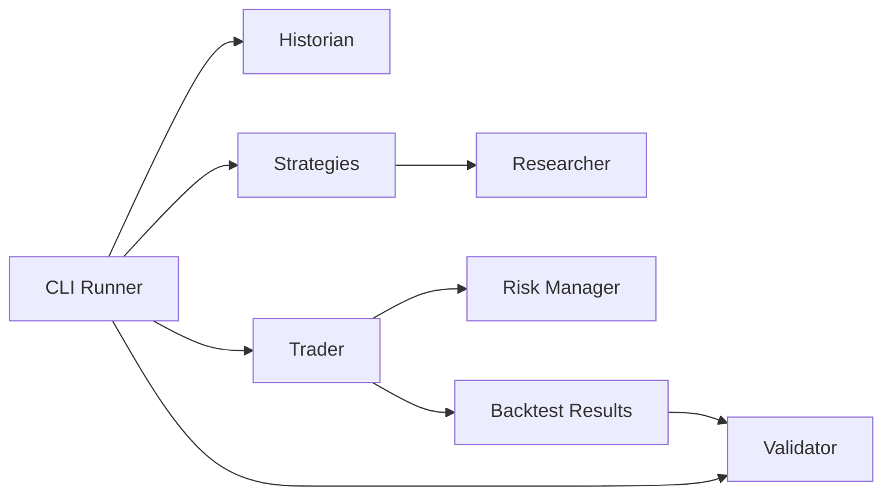

# Architecture

PTB-1 is organized around small modules with one responsibility each.

Every feature proposal must answer:

Does this improve PTB-1's ability to discover or validate trading strategies?

If the answer is no, do not implement it.

## Current Runtime Flow

## Employees

### Historian

Module: `ptb1/historian.py`

Responsibilities:

- Load historical data.
- Maintain historical datasets.

Must not:

- Perform trading logic.
- Generate signals.
- Calculate strategy performance.

### Researcher

Module: `ptb1/researcher.py`

Responsibilities:

- Define strategy signals.
- Define the shared strategy interface.

Must not:

- Execute trades.
- Size positions.
- Calculate portfolio results.

### Strategies

Module: `ptb1/strategies.py`

Responsibilities:

- Implement independent research strategies.
- Expose the explicit strategy registry.

Must not:

- Execute trades.
- Calculate performance metrics.
- Load datasets.

### Trader

Module: `ptb1/trader.py`

Responsibilities:

- Execute backtests.
- Execute paper trades in a future milestone.
- Execute live trades only in a future milestone.

Must not:

- Create strategies.
- Load datasets.
- Calculate final performance metrics.

### Validator

Module: `ptb1/validator.py`

Responsibilities:

- Calculate performance metrics.
- Report validation statistics.

Current metrics include:

- Return.
- Drawdown.
- Optional Sharpe ratio.

Future metrics include:

- Win rate.
- CAGR.
- Profit factor.
- Expectancy.
- Trade statistics.

### Risk Manager

Module: `ptb1/risk_manager.py`

Responsibilities:

- Position sizing.
- Maximum exposure.
- Risk rules.
- Daily stop limits in future milestones.

Must not:

- Create strategies.
- Load historical data.

## Strategy Graveyard

A future milestone should maintain a Strategy Graveyard for failed strategies.

Each archived strategy should record:

- Strategy name.
- Date archived.
- Trade count.
- Performance.
- Reason for failure.
- Replacement strategy, if any.

The goal is to avoid repeating failed research.
