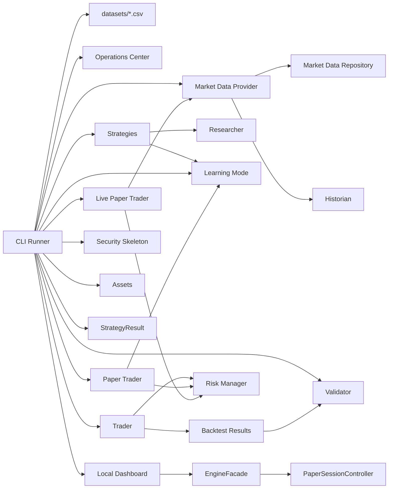

# Architecture

QMR.CO is organized around small modules with one responsibility each.

The Python package remains `ptb1` for compatibility.

Every feature proposal must answer:

Does this improve QMR.CO's ability to discover or validate trading strategies?

If the answer is no, do not implement it.

## Current Runtime Flow



## Dataset Storage

Historical datasets live in `datasets/` as plain CSV files.

Each CSV uses this format:

```csv
symbol,date,open,high,low,close,volume
```

Dataset names come from filenames without `.csv`.

## Employees

### Historian

Module: `ptb1/historian.py`

Responsibilities:

- Load historical data.
- Validate historical CSV shape and values.
- Maintain historical datasets.

Must not:

- Perform trading logic.
- Generate signals.
- Calculate strategy performance.

### Market Data

Module: `ptb1/market_data.py`

Responsibilities:

- Define the internal market data provider interface.
- Provide the current CSV provider.
- Provide the primary Stooq live market data provider.
- Provide the internal HTTP market provider foundation.
- Keep the HTTP provider as legacy fallback.
- Provide provider-neutral market data results.
- Manage in-memory market data freshness.
- Apply rate-limit cooldowns.
- Provide safe provider diagnostics.
- Set request hygiene headers for live provider requests.
- Provide read-only quote data.
- Delegate CSV loading to Historian.
- Convert HTTP provider responses into Historian-compatible rows.
- Hide provider-specific response formats.

Must not:

- Parse CSV files directly.
- Validate CSV rows directly.
- Create PriceBar objects directly.
- Connect to Robinhood.
- Connect to brokers.
- Place orders.
- Expose provider-specific response objects outside the provider.
- Label stale data as fresh.
- Dump full provider response bodies into logs or output.

### Security

Module: `ptb1/security.py`

Responsibilities:

- Provide redaction utilities for sensitive output.
- Validate secrets loaded from environment-style sources.
- Provide safe-to-view audit entries.
- Validate config with fail-closed defaults.
- Provide a compress-first protected storage placeholder interface.
- Preserve metadata needed for future key rotation and user-owned keys.

Must not:

- Claim production-grade encryption without an approved crypto dependency.
- Print secrets.
- Log raw emails, IP addresses, API keys, tokens, broker credentials, account IDs, or tax data.
- Place trades.
- Connect to brokers.
- Change strategy logic.
- Change research, paper, or live-paper behavior.

### Assets

Module: `ptb1/assets.py`

Responsibilities:

- Represent stocks, ETFs, crypto, and future asset categories.
- Store provider-neutral asset metadata.
- Mark crypto assets as research-only by default.
- Validate asset metadata at construction time.

Must not:

- Fetch market data.
- Place trades.
- Connect to wallets.
- Connect to exchanges.
- Connect to brokers.
- Enable live crypto trading.
- Change paper trading behavior.

### Strategy Result

Module: `ptb1/strategy_result.py`

Responsibilities:

- Define `ResearchContext` for future strategy evaluation context.
- Define `StrategyResult` for explainable strategy decisions.
- Validate strategy result confidence and descriptive reasons.
- Format strategy results as plain console text.

Must not:

- Replace current strategy behavior yet.
- Calculate indicators.
- Execute trades.
- Modify risk decisions.
- Serialize UI or API responses.
- Add templating or formatting dependencies.


### Engine Facade

Module: `ptb1/engine.py`

Responsibilities:

- Provide the dashboard's stable boundary into engine-owned behavior.
- Validate dashboard paper-session requests.
- Delegate paper-session lifecycle to `PaperSessionController`.
- Expose immutable snapshots and ordered events.
- Expose provider status, market data, strategy education, and research status without exposing engine internals.

Must not:

- Duplicate provider fetching, strategy calculations, risk rules, paper-order behavior, or portfolio accounting.
- Expose provider clients, locks, raw exceptions, secrets, or paper-account internals to the dashboard.

### Paper Session Controller

Module: `ptb1/paper_session.py`

Responsibilities:

- Own one application-wide fake-money session.
- Own one sequential background scanner worker.
- Provide thread-safe start, stop, restart, shutdown, snapshot, symbol update, and event access.
- Record ordered append-only in-memory events, including `USER_ACTION`.
- Delegate provider data to `ProviderManager`, strategy signals to registered strategies, risk decisions to `RiskManager`, and fake order/account mutation to the existing paper module.

Must not:

- Place real orders.
- Connect to brokers.
- Duplicate provider, strategy, risk, or paper-account logic.
- Persist session state.
- Scan unbounded symbol universes or introduce uncontrolled parallel network requests.

### Snapshot Contracts

Module: `ptb1/snapshots.py`

Responsibilities:

- Define frozen dashboard transport snapshots for paper sessions, scanner state, symbols, positions, orders, trades, and events.
- Serialize safe snapshot data for local JSON APIs.
- Preserve unavailable values as `None` and use tuples for public collections.

Must not:

- Fetch data, run strategies, approve risk, place orders, mutate accounts, start workers, persist state, or format HTML.

### Dashboard

Module: `ptb1/dashboard.py`

Responsibilities:

- Serve a localhost-only read-only dashboard.
- Render dashboard HTML, CSS, and lightweight local JavaScript with standard library tools.
- Own centralized local dashboard design tokens and reusable rendering helpers.
- Keep visual structure separate from API and engine behavior.
- Display safe platform, provider, paper, live-paper, and trust state.
- Provide safe local JSON routes for status, markets, watchlist, strategies, research, paper, and security.
- Maintain dashboard-local in-memory watchlist state for the running server process.
- Reach paper-session behavior only through `EngineFacade`.
- Validate watchlist symbols before requesting provider data.
- Use ProviderManager cache and cooldown behavior for market refreshes.
- Print the local dashboard URL at startup.

Must not:

- Publicly host QMR.CO.
- Add accounts, login, payments, databases, or persistence.
- Fetch market data except through explicit read-only dashboard market/watchlist requests.
- Mutate core engine watchlists or provider state.
- Run strategies.
- Run research.
- Start paper or live-paper sessions.
- Place trades.
- Connect to brokers.
- Connect to Robinhood.
- Change paper-account behavior.

### Operations Center

Module: `ptb1/operations.py`

Responsibilities:

- Display startup banner.
- Display platform status.
- Display version.
- Display runtime.
- Display registered strategy count.
- Display dataset count.
- Display market provider status.
- Display verification summary.
- Render the menu.
- Maintain the in-memory read-only watchlist.
- Display live market intelligence.
- Display repository-backed watchlist status.
- Validate user-entered watchlist symbols before storing them.
- Request one provider refresh when a valid symbol is added.
- Display provider manager, primary provider, fallback provider, provider used, and provider attempts.

Must not:

- Execute trades.
- Calculate metrics.
- Modify strategies.
- Modify research behavior.
- Modify paper trading behavior.
- Own validation.
- Own risk management.
- Own market data retrieval.
- Calculate trading signals from live prices.
- Persist watchlist data.
- Poll in the background.

### Researcher

Module: `ptb1/researcher.py`

Responsibilities:

- Define strategy signals.
- Define the shared strategy interface.

Must not:

- Execute trades.
- Size positions.
- Calculate portfolio results.

### Strategies

Module: `ptb1/strategies.py`

Responsibilities:

- Implement independent research strategies.
- Expose the explicit strategy registry.
- Provide static education metadata.

Must not:

- Execute trades.
- Calculate performance metrics.
- Load datasets.
- Know dataset names.

### Learning Mode

Module: `ptb1/learning.py`

Responsibilities:

- Provide plain-English strategy education.
- Provide glossary entries.
- Provide template-based explanations from static metadata or measured metrics.

Must not:

- Place trades.
- Change strategies.
- Change parameters.
- Modify research results.
- Modify risk rules.
- Influence trading or backtest decisions.

### Trader

Module: `ptb1/trader.py`

Responsibilities:

- Execute backtests.
- Record execution facts.
- Execute live trades only in a future milestone.

Must not:

- Create strategies.
- Load datasets.
- Know dataset names.
- Calculate statistics.
- Generate research notes.

### Paper Trader

Module: `ptb1/paper.py`

Responsibilities:

- Run fake-money paper sessions.
- Track fake cash balance.
- Track fake long-only positions.
- Record fake paper orders.
- Record completed fake paper trades.
- Calculate paper account value, realized profit/loss, and unrealized profit/loss.
- Record paper session diagnostics.

Must not:

- Place real trades.
- Connect to a broker.
- Execute research backtests.
- Calculate Validator research metrics.
- Create strategies.
- Change strategy signals.
- Change risk rules.

### Live Paper Trader

Module: `ptb1/live_paper.py`

Responsibilities:

- Run fake-money live paper loops.
- Request recent bars through the market data provider layer.
- Use only fresh valid market data for fake orders.
- Run one selected strategy against recent bars.
- Ask Risk Manager before fake order fills.
- Track fake account state for the running live paper session.
- Log every live paper decision.
- Display final session summary on completion or Ctrl+C.
- Pause when market data is missing, stale, failed, malformed, rate-limited, or cooling down.

Must not:

- Place real trades.
- Connect to a broker.
- Connect to Robinhood.
- Use margin.
- Short sell.
- Trade options.
- Persist session state.
- Run in the background.
- Change strategy signals.
- Calculate Validator research metrics.
- Trade from stale or invalid market data.

### Validator

Module: `ptb1/validator.py`

Responsibilities:

- Calculate performance metrics.
- Calculate comparison winners.
- Generate mechanical notes supported by measured metrics.
- Calculate cross-dataset summaries.

Current metrics include:

- Total return.
- CAGR when enough data exists.
- Max drawdown.
- Sharpe ratio.
- Profit factor.
- Expectancy.
- Win rate.
- Average winning trade.
- Average losing trade.
- Largest winner.
- Largest loser.
- Average holding period.
- Total trades.
- Exposure time.
- Average return across datasets.
- Average drawdown across datasets.
- Dataset win count.

### Risk Manager

Module: `ptb1/risk_manager.py`

Responsibilities:

- Position sizing.
- Maximum exposure.
- Risk rules.
- Daily stop limits in future milestones.

Must not:

- Create strategies.
- Load historical data.

### CLI Runner

Module: `ptb1/cli.py`

Responsibilities:

- Launch the Operations Center when no flags are provided.
- Select one dataset or all datasets.
- Use the internal CSV market data provider.
- Keep live market data provider internals out of the public CLI.
- Orchestrate strategy runs.
- Display dataset loading errors.
- Display strategy research reports.
- Display comparison summaries.
- Display research notes.
- Display cross-dataset summaries.
- Display Learning Mode content.
- Display paper trading summaries, logs, and diagnostics.
- Display QMR.CO branding.

Must not:

- Calculate metrics.
- Generate strategy signals.
- Execute trades.

## Strategy Graveyard

A future milestone should maintain a Strategy Graveyard for failed strategies.

Each archived strategy should record:

- Strategy name.
- Date archived.
- Trade count.
- Performance.
- Reason for failure.
- Replacement strategy, if any.

Milestone 2.5 only prints archive candidate notes. It does not create Strategy Graveyard files.
