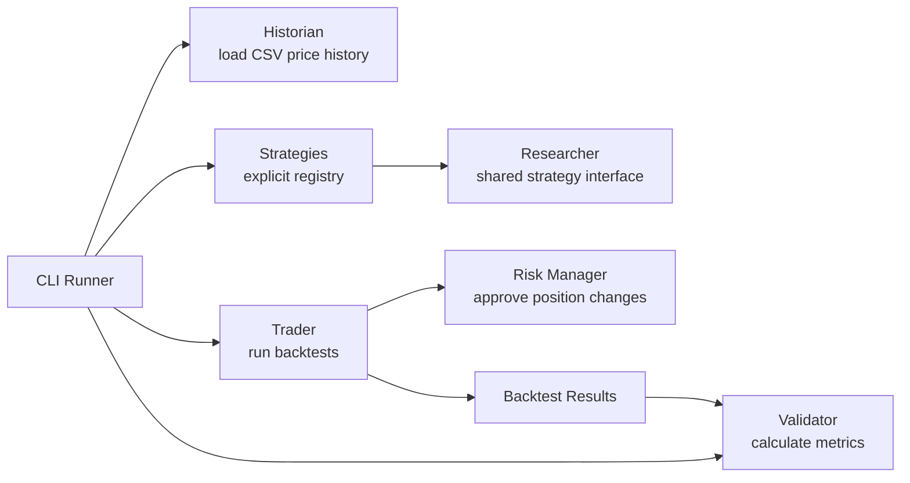

# PTB-1

PTB-1 is an AI trading research platform. It is not a live trading bot.

Milestone 2 runs multiple independent research strategies against the same historical CSV dataset and compares their results. It does not include Robinhood, AI, machine learning, paper trading, live trading, or automation.

## Project Brain

- [Vision](VISION.md)
- [Roadmap](ROADMAP.md)
- [Architecture](ARCHITECTURE.md)
- [Contributing](CONTRIBUTING.md)
- [Changelog](CHANGELOG.md)

## Run Milestone 2

From a clean clone with Python installed:

```powershell
python -m ptb1 --data sample_prices.csv
```

No third-party dependencies are required.

## Architecture



## Responsibilities

| Employee | Module | One responsibility |
| --- | --- | --- |
| Historian | `ptb1/historian.py` | Load historical market data. |
| Researcher | `ptb1/researcher.py` | Define strategy signals and strategy interface. |
| Strategies | `ptb1/strategies.py` | Implement independent research strategies. |
| Trader | `ptb1/trader.py` | Run research backtests. |
| Risk Manager | `ptb1/risk_manager.py` | Approve or reject position changes. |
| Validator | `ptb1/validator.py` | Calculate performance metrics. |
| CLI Runner | `ptb1/cli.py` | Wire the modules together for command-line use. |

No module should do another employee's job.

## Roadmap

1. Backtest one strategy. Done in Milestone 1.
2. Support multiple strategies. Done in Milestone 2.
3. Paper trading.
4. Portfolio tracking.
5. Robinhood MCP.
6. AI researcher.
7. Learning engine.
8. Market Memory.
9. Mobile Dashboard.
