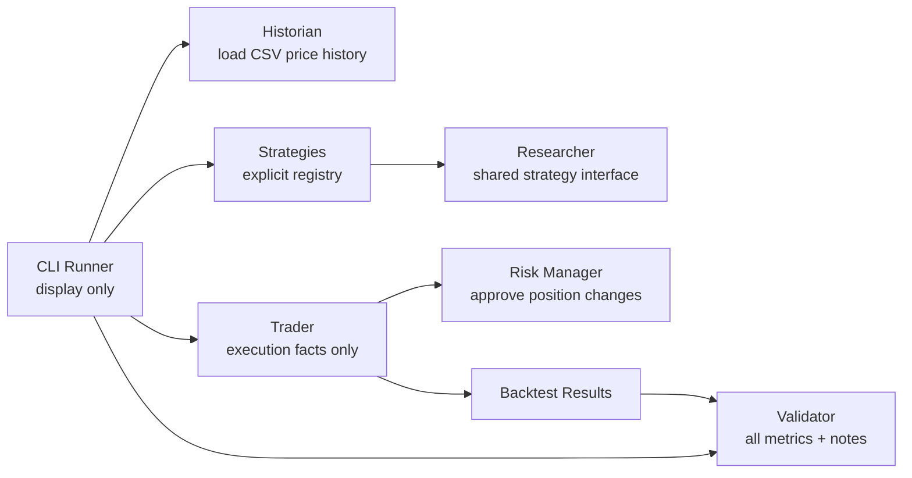

# PTB-1

PTB-1 is an AI trading research platform. It is not a live trading bot.

Milestone 2.5 strengthens PTB-1 as a research lab. It runs multiple independent research strategies against the same historical CSV dataset, prints structured research reports, compares key metrics, and emits mechanical notes based only on measured results.

It does not include Robinhood, AI, machine learning, paper trading, live trading, optimization, or automation.

## Project Brain

- [Vision](VISION.md)
- [Roadmap](ROADMAP.md)
- [Architecture](ARCHITECTURE.md)
- [Contributing](CONTRIBUTING.md)
- [Changelog](CHANGELOG.md)

## Run Milestone 2.5

From a clean clone with Python installed:

```powershell
python -m ptb1 --data sample_prices.csv
```

No third-party dependencies are required.

## Architecture



## Responsibilities

| Employee | Module | One responsibility |
| --- | --- | --- |
| Historian | `ptb1/historian.py` | Load historical market data. |
| Researcher | `ptb1/researcher.py` | Define strategy signals and strategy interface. |
| Strategies | `ptb1/strategies.py` | Implement independent research strategies. |
| Trader | `ptb1/trader.py` | Run backtests and record execution facts. |
| Risk Manager | `ptb1/risk_manager.py` | Approve or reject position changes. |
| Validator | `ptb1/validator.py` | Calculate metrics, comparison winners, and mechanical notes. |
| CLI Runner | `ptb1/cli.py` | Display reports. |

No module should do another employee's job.

## Roadmap

1. Backtest one strategy. Done in Milestone 1.
2. Support multiple strategies. Done in Milestone 2.
3. Research Lab. Done in Milestone 2.5.
4. Paper trading.
5. Portfolio tracking.
6. Robinhood MCP.
7. AI researcher.
8. Learning engine.
9. Market Memory.
10. Mobile Dashboard.
