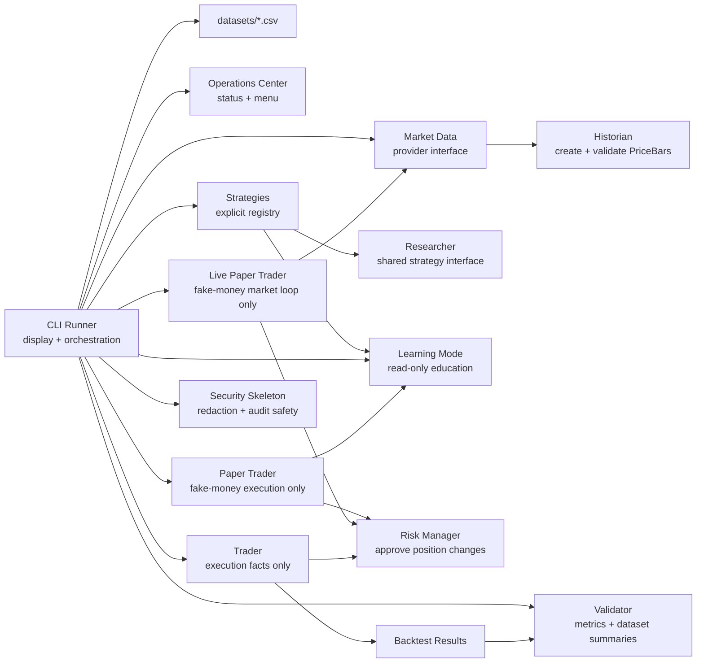

# QMR.CO

QMR.CO is an AI trading research platform. It is not a live trading bot.

The Python package remains `ptb1` for compatibility.

Milestone 4 adds a Paper Trading Engine. QMR.CO can still run research backtests across one or many CSV datasets, and it can now run one strategy at a time with fake money only.
Milestone 4.5 adds an internal market data provider interface with CSV as the only current provider.
Milestone 5 adds an internal HTTP market data foundation without adding public market-data commands or live trading.
Milestone 5.1 adds a display-only Operations Center as the default platform entry point.
Milestone 6 rebrands the user experience to QMR.CO and adds read-only Live Market Intelligence with an in-memory watchlist.
Milestone 6.5 adds fake-money live paper trading and a simple PowerShell launcher.
Milestone 6.7 adds market-layer reliability with in-memory caching, cooldowns, and no-trade safety for bad data.
Milestone 7 adds a standard-library Security Skeleton for redaction, safe audit logs, secret validation, config validation, and a compress-first protected storage placeholder.
Milestone 7.1 adds safe provider diagnostics and HTTP request hygiene for live price recovery.
Milestone 7.2 makes Stooq the primary no-key live price provider with the existing HTTP provider as fallback.
Milestone 7.3 polishes the Operations Center with watchlist validation, immediate add-time provider checks, clearer provider status display, and version `v0.7.3`.

Learning Mode is a read-only companion feature. It teaches what QMR.CO is doing, explains strategy concepts, and defines research terms. It does not run backtests, place trades, change strategies, change parameters, modify risk, or influence decisions.

QMR.CO does not include Robinhood, AI, machine learning, live trading, optimization, or automation.

## Project Brain

- [Vision](VISION.md)
- [Roadmap](ROADMAP.md)
- [Architecture](ARCHITECTURE.md)
- [Contributing](CONTRIBUTING.md)
- [Changelog](CHANGELOG.md)

## Run QMR.CO

Launch the Operations Center:

```powershell
python -m ptb1
```

Launch the Operations Center with the PowerShell shortcut:

```powershell
.\qmr.ps1
```

Run one dataset:

```powershell
python -m ptb1 --data datasets/sample_prices.csv
```

Run every dataset in `datasets/`:

```powershell
python -m ptb1 --all-datasets
```

Print Learning Mode education and glossary content:

```powershell
python -m ptb1 --learning
```

Run one fake-money paper session:

```powershell
python -m ptb1 --paper --strategy RSI --data datasets/sample_prices.csv
```

Run a limited fake-money live paper session:

```powershell
python -m ptb1 --live-paper --symbol AMD --strategy RSI --cash 10000 --interval 1 --max-iterations 3
```

Check the live price provider safely:

```powershell
python -m ptb1 --provider-check --symbol AMD
```

Print the fake paper order and trade logs:

```powershell
python -m ptb1 --paper --strategy RSI --data datasets/sample_prices.csv --paper-log
```

Run the stability harness:

```powershell
python -m unittest discover
```

The root `sample_prices.csv` still works for backward compatibility:

```powershell
python -m ptb1 --data sample_prices.csv
```

No third-party dependencies are required.

## Security & Trust

QMR.CO is designed around a collect-less privacy model. It must not sell, rent, broker, or monetize personal user data.

Security rules:

- No secrets in source code.
- No raw secrets, emails, IP addresses, account IDs, broker credentials, or tax data in logs.
- Audit entries must be safe to view and share.
- Unsafe config fails closed.
- Private user data should be protected before storage.

Milestone 7 uses only the Python standard library. `SecureStorage` compresses data before storing it in a protected placeholder format with integrity metadata, but this is not production-grade encryption. True production encryption requires a future approved crypto dependency.

## Architecture



## Responsibilities

| Employee | Module | One responsibility |
| --- | --- | --- |
| Historian | `ptb1/historian.py` | Load and validate historical market data. |
| Operations Center | `ptb1/operations.py` | Display platform status, menu options, and read-only watchlist state. |
| Market Data | `ptb1/market_data.py` | Provide internal providers, Stooq primary live data, HTTP fallback, cached market results, cooldowns, diagnostics, and provider-neutral status. |
| Researcher | `ptb1/researcher.py` | Define strategy signals and strategy interface. |
| Strategies | `ptb1/strategies.py` | Implement independent research strategies and static education metadata. |
| Learning Mode | `ptb1/learning.py` | Provide read-only educational text and glossary entries. |
| Trader | `ptb1/trader.py` | Run backtests and record execution facts. |
| Paper Trader | `ptb1/paper.py` | Run fake-money paper sessions and record paper account facts. |
| Live Paper Trader | `ptb1/live_paper.py` | Run fake-money live paper loops through the provider layer. |
| Security | `ptb1/security.py` | Provide redaction, safe audit logs, secret validation, config validation, and protected storage interfaces. |
| Risk Manager | `ptb1/risk_manager.py` | Approve or reject position changes. |
| Validator | `ptb1/validator.py` | Calculate metrics, comparison winners, notes, and cross-dataset summaries. |
| CLI Runner | `ptb1/cli.py` | Orchestrate runs and display reports or Learning Mode content. |

No module should do another employee's job.

## Roadmap

1. Backtest one strategy. Done in Milestone 1.
2. Support multiple strategies. Done in Milestone 2.
3. Research Lab. Done in Milestone 2.5.
4. Dataset Engine. Done in Milestone 3.
5. Paper trading. Done in Milestone 4.
6. Market data provider interface. Done in Milestone 4.5.
7. Live market data foundation. Done in Milestone 5.
8. Operations Center. Done in Milestone 5.1.
9. Live Market Intelligence. Done in Milestone 6.
10. Live paper trading. Done in Milestone 6.5.
11. Market layer reliability. Done in Milestone 6.7.
12. Security Skeleton. Done in Milestone 7.
13. Price provider recovery. Done in Milestone 7.1.
14. Stooq primary provider. Done in Milestone 7.2.
15. Operations Center polish. Done in Milestone 7.3.
16. Portfolio tracking.
17. Robinhood MCP.
18. AI researcher.
19. Learning engine.
20. Market Memory.
21. Mobile Dashboard.
