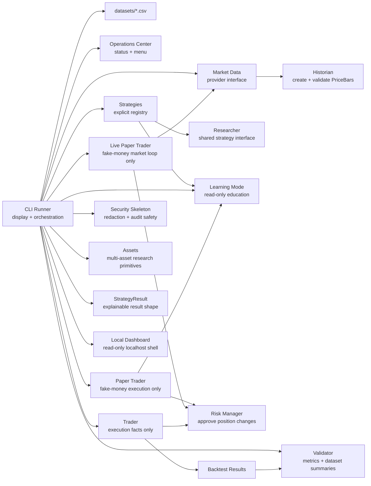

# QMR.CO

QMR.CO is an AI trading research platform. It is not a live trading bot.

The Python package remains `ptb1` for compatibility.

Milestone 4 adds a Paper Trading Engine. QMR.CO can still run research backtests across one or many CSV datasets, and it can now run one strategy at a time with fake money only.
Milestone 4.5 adds an internal market data provider interface with CSV as the only current provider.
Milestone 5 adds an internal HTTP market data foundation without adding public market-data commands or live trading.
Milestone 5.1 adds a display-only Operations Center as the default platform entry point.
Milestone 6 rebrands the user experience to QMR.CO and adds read-only Live Market Intelligence with an in-memory watchlist.
Milestone 6.5 adds fake-money live paper trading and a simple PowerShell launcher.
Milestone 6.7 adds market-layer reliability with in-memory caching, cooldowns, and no-trade safety for bad data.
Milestone 7 adds a standard-library Security Skeleton for redaction, safe audit logs, secret validation, config validation, and a compress-first protected storage placeholder.
Milestone 7.1 adds safe provider diagnostics and HTTP request hygiene for live price recovery.
Milestone 7.2 makes Stooq the primary no-key live price provider with the existing HTTP provider as fallback.
Milestone 7.3 polishes the Operations Center with watchlist validation, immediate add-time provider checks, clearer provider status display, and version `v0.7.3`.
Internal Milestone 8 adds the Unified Research Framework foundation with shared asset primitives, `ResearchContext`, and explainable `StrategyResult` objects. This is additive architecture only and does not change current runtime behavior.
Milestone 8 adds a localhost-only read-only web dashboard shell for QMR.CO. It is a display surface only and does not fetch market data, mutate watchlists, or place trades.
Milestone 8.1 makes the local dashboard functional with read-only JSON APIs, single-page navigation, market cards, and a dashboard-local in-memory watchlist. It still does not place trades, start sessions, persist data, or mutate core engine state.
Milestone 8.2 cleans up the dashboard visual system with centralized design tokens, reusable render helpers, premium dark styling, responsive layout, clearer empty states, and consistent cards, tables, forms, badges, and safety messaging. It does not change dashboard APIs or engine behavior.
The accelerated dashboard paper scanner vertical slice adds a website-operated fake-money session through `EngineFacade` and `PaperSessionController`. It uses one application-wide in-memory session, one sequential background scanner, a bounded 20-symbol default universe, a 15-minute default interval, and a 5-minute minimum interval. It remains fake-money only: no broker, no real orders, no database, no persistence, no cookies, no browser client IDs, and no per-tab sessions.
Milestone 8.5.1 adds a functional local application shell: `/` serves the public landing page, `/app` serves the dashboard, and `/app/research`, `/app/market`, `/app/strategies`, `/app/portfolio`, `/app/paper`, and `/app/reports` deep-link into application views. Sidebar navigation, landing CTAs, symbol search, and paper-session controls are functional while unfinished modules show deliberate empty states.
Milestone 8.6 polishes company, education, risk, and membership content. It adds dedicated public routes for About, Platform, Membership/Pricing, Sign In Coming Soon, and beginner/intermediate/advanced learning pages; fixes market-status color/label consistency; and keeps auth, payments, broker connections, and real trading unavailable.
Milestone 9B improves the local dashboard's mobile responsive UX with touch-friendly navigation, safe-area spacing, compact cards, responsive tables, and clearer mobile empty states. It does not change APIs, LAN security, providers, paper sessions, brokers, or trading behavior.

Learning Mode is a read-only companion feature. It teaches what QMR.CO is doing, explains strategy concepts, and defines research terms. It does not run backtests, place trades, change strategies, change parameters, modify risk, or influence decisions.

QMR.CO does not include Robinhood, AI, machine learning, live trading, optimization, or automation.

Crypto assets can be represented for research foundation work only. QMR.CO does not include wallets, exchange trading, crypto broker integration, or live crypto trading.

## Project Brain

- [Vision](VISION.md)
- [Roadmap](ROADMAP.md)
- [Architecture](ARCHITECTURE.md)
- [Contributing](CONTRIBUTING.md)
- [Changelog](CHANGELOG.md)

## Run QMR.CO

Launch the Operations Center:

```powershell
python -m ptb1
```

Launch the local application server:

```powershell
python -m ptb1 --dashboard
```

By default, the dashboard binds only to loopback:

```text
127.0.0.1:8765
```

For development on devices connected to the same LAN, explicitly enable LAN mode:

```powershell
python -m ptb1 --dashboard --lan
```

LAN mode binds to `0.0.0.0:8765` and prints both a local URL and a network URL. It also prints a temporary LAN access code. A LAN browser must submit that code before it can use the dashboard; the server then issues a separate in-memory session token and CSRF token. Sessions expire after 30 minutes of inactivity and are invalidated when the dashboard server restarts.

The temporary LAN access code protects against accidental or casual unauthorized access. It does not provide confidentiality against a compromised or hostile network because development LAN mode does not use HTTPS.

LAN mode does not add accounts, production authentication, internet exposure, tunneling, port forwarding, cloud deployment, broker access, or real trading. `real_trading_enabled` remains false.

Local routes:

```text
/                  Public landing page
/platform          Product workflow overview
/about             Company mission and founder note
/membership        Membership and planned pricing
/pricing           Alias for membership and planned pricing
/sign-in           Coming soon, no authentication form
/learn/beginner    Beginner education page
/learn/intermediate Intermediate education page
/learn/advanced    Advanced education page
/app               QMR.CO dashboard overview
/app/research      Research view
/app/market        Market/watchlist view
/app/strategies    Strategies view
/app/portfolio     Portfolio view
/app/paper         Fake-money paper trading view
/app/risk          Risk analysis view with honest empty states
/app/reports       Reports placeholder
```

Local dashboard API routes:

```text
GET  /api/status
GET  /api/markets?symbols=AMD,AAPL,SPY
GET  /api/watchlist
POST /api/watchlist/add
POST /api/watchlist/remove
POST /api/watchlist/refresh
GET  /api/strategies
GET  /api/research
GET  /api/paper
GET  /api/security
```

The watchlist is dashboard-local memory only. It is not persisted and does not change trading, research, paper, or provider configuration.

Launch the Operations Center with the PowerShell shortcut:

```powershell
.\qmr.ps1
```

Run one dataset:

```powershell
python -m ptb1 --data datasets/sample_prices.csv
```

Run every dataset in `datasets/`:

```powershell
python -m ptb1 --all-datasets
```

Print Learning Mode education and glossary content:

```powershell
python -m ptb1 --learning
```

Run one fake-money paper session:

```powershell
python -m ptb1 --paper --strategy RSI --data datasets/sample_prices.csv
```

Run a limited fake-money live paper session:

```powershell
python -m ptb1 --live-paper --symbol AMD --strategy RSI --cash 10000 --interval 1 --max-iterations 3
```

Check the live price provider safely:

```powershell
python -m ptb1 --provider-check --symbol AMD
```

Print the fake paper order and trade logs:

```powershell
python -m ptb1 --paper --strategy RSI --data datasets/sample_prices.csv --paper-log
```

Run the stability harness:

```powershell
python -m unittest discover
```

The root `sample_prices.csv` still works for backward compatibility:

```powershell
python -m ptb1 --data sample_prices.csv
```

No third-party dependencies are required.


## Dashboard Fake-Money Scanner

The local dashboard can operate one fake-money paper scanner session through the engine boundary:

```text
DashboardApplication
        -> EngineFacade
        -> PaperSessionController
        -> existing provider, strategy, risk, and paper engines
```

Safety facts:

- Fake money only.
- No broker connectivity.
- No real orders are possible.
- One application-wide local session exists at a time.
- One background scanner exists at a time.
- The scanner universe is intentionally bounded to 40 symbols maximum.
- The default universe is `SPY, QQQ, DIA, IWM, AAPL, MSFT, NVDA, AMD, AMZN, META, GOOGL, TSLA, JPM, BAC, XOM, CVX, WMT, COST, UNH, CAT`.
- The scanner runs sequentially to avoid uncontrolled provider requests.
- Default interval is 15 minutes. Minimum interval is 5 minutes.
- The computer must remain powered on and awake.
- The Python process must remain running.
- Internet access must remain available for live provider data.
- Session state is in memory only. Stopping the process ends the session.
- No browser client IDs, cookies, persistence, database, per-tab sessions, or account system exist.

## Security & Trust

QMR.CO is designed around a collect-less privacy model. It must not sell, rent, broker, or monetize personal user data.

Security rules:

- No secrets in source code.
- No raw secrets, emails, IP addresses, account IDs, broker credentials, or tax data in logs.
- Audit entries must be safe to view and share.
- Unsafe config fails closed.
- Private user data should be protected before storage.

Milestone 7 uses only the Python standard library. `SecureStorage` compresses data before storing it in a protected placeholder format with integrity metadata, but this is not production-grade encryption. True production encryption requires a future approved crypto dependency.

## Architecture



## Responsibilities

| Employee | Module | One responsibility |
| --- | --- | --- |
| Historian | `ptb1/historian.py` | Load and validate historical market data. |
| Operations Center | `ptb1/operations.py` | Display platform status, menu options, and read-only watchlist state. |
| Market Data | `ptb1/market_data.py` | Provide internal providers, Stooq primary live data, HTTP fallback, cached market results, cooldowns, diagnostics, and provider-neutral status. |
| Assets | `ptb1/assets.py` | Represent stocks, ETFs, crypto, and future asset categories for research. |
| Strategy Result | `ptb1/strategy_result.py` | Define future explainable strategy results and research context. |
| Dashboard | `ptb1/dashboard.py` | Serve a localhost-only read-only dashboard and safe local JSON APIs. |
| Researcher | `ptb1/researcher.py` | Define strategy signals and strategy interface. |
| Strategies | `ptb1/strategies.py` | Implement independent research strategies and static education metadata. |
| Learning Mode | `ptb1/learning.py` | Provide read-only educational text and glossary entries. |
| Trader | `ptb1/trader.py` | Run backtests and record execution facts. |
| Paper Trader | `ptb1/paper.py` | Run fake-money paper sessions and record paper account facts. |
| Live Paper Trader | `ptb1/live_paper.py` | Run fake-money live paper loops through the provider layer. |
| Security | `ptb1/security.py` | Provide redaction, safe audit logs, secret validation, config validation, and protected storage interfaces. |
| Risk Manager | `ptb1/risk_manager.py` | Approve or reject position changes. |
| Validator | `ptb1/validator.py` | Calculate metrics, comparison winners, notes, and cross-dataset summaries. |
| CLI Runner | `ptb1/cli.py` | Orchestrate runs and display reports or Learning Mode content. |

No module should do another employee's job.

## Roadmap

1. Backtest one strategy. Done in Milestone 1.
2. Support multiple strategies. Done in Milestone 2.
3. Research Lab. Done in Milestone 2.5.
4. Dataset Engine. Done in Milestone 3.
5. Paper trading. Done in Milestone 4.
6. Market data provider interface. Done in Milestone 4.5.
7. Live market data foundation. Done in Milestone 5.
8. Operations Center. Done in Milestone 5.1.
9. Live Market Intelligence. Done in Milestone 6.
10. Live paper trading. Done in Milestone 6.5.
11. Market layer reliability. Done in Milestone 6.7.
12. Security Skeleton. Done in Milestone 7.
13. Price provider recovery. Done in Milestone 7.1.
14. Stooq primary provider. Done in Milestone 7.2.
15. Operations Center polish. Done in Milestone 7.3.
16. Unified Research Framework foundation. Done in Internal Milestone 8.
17. Local Web Dashboard Shell. Done in Milestone 8.
18. Functional read-only dashboard. Done in Milestone 8.1.
19. Dashboard visual system cleanup. Done in Milestone 8.2.
20. Functional navigation and landing-page integration. Done in Milestone 8.5.1.
21. Company, education, risk, and membership polish. Done in Milestone 8.6.
22. Portfolio tracking.
23. Robinhood MCP.
24. AI researcher.
25. Learning engine.
26. Market Memory.
27. Mobile Dashboard.
