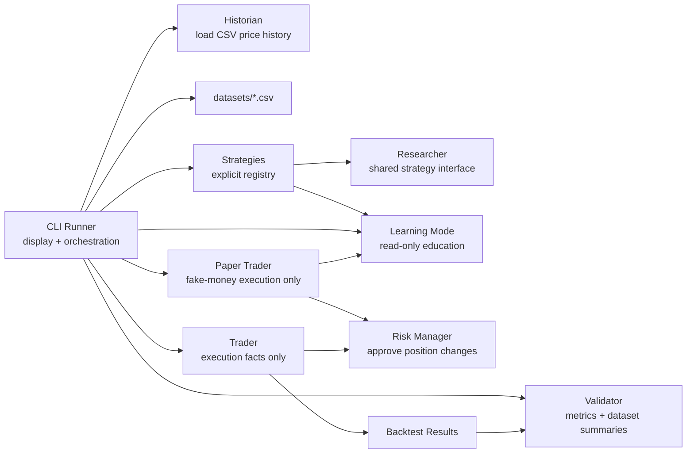

# PTB-1

PTB-1 is an AI trading research platform. It is not a live trading bot.

Milestone 4 adds a Paper Trading Engine. PTB-1 can still run research backtests across one or many CSV datasets, and it can now run one strategy at a time with fake money only.

Learning Mode is a read-only companion feature. It teaches what PTB-1 is doing, explains strategy concepts, and defines research terms. It does not run backtests, place trades, change strategies, change parameters, modify risk, or influence decisions.

PTB-1 does not include Robinhood, AI, machine learning, live trading, optimization, or automation.

## Project Brain

- [Vision](VISION.md)
- [Roadmap](ROADMAP.md)
- [Architecture](ARCHITECTURE.md)
- [Contributing](CONTRIBUTING.md)
- [Changelog](CHANGELOG.md)

## Run Milestone 3

Run one dataset:

```powershell
python -m ptb1 --data datasets/sample_prices.csv
```

Run every dataset in `datasets/`:

```powershell
python -m ptb1 --all-datasets
```

Print Learning Mode education and glossary content:

```powershell
python -m ptb1 --learning
```

Run one fake-money paper session:

```powershell
python -m ptb1 --paper --strategy RSI --data datasets/sample_prices.csv
```

Print the fake paper order and trade logs:

```powershell
python -m ptb1 --paper --strategy RSI --data datasets/sample_prices.csv --paper-log
```

Run the stability harness:

```powershell
python -m unittest discover
```

The root `sample_prices.csv` still works for backward compatibility:

```powershell
python -m ptb1 --data sample_prices.csv
```

No third-party dependencies are required.

## Architecture



## Responsibilities

| Employee | Module | One responsibility |
| --- | --- | --- |
| Historian | `ptb1/historian.py` | Load and validate historical market data. |
| Researcher | `ptb1/researcher.py` | Define strategy signals and strategy interface. |
| Strategies | `ptb1/strategies.py` | Implement independent research strategies and static education metadata. |
| Learning Mode | `ptb1/learning.py` | Provide read-only educational text and glossary entries. |
| Trader | `ptb1/trader.py` | Run backtests and record execution facts. |
| Paper Trader | `ptb1/paper.py` | Run fake-money paper sessions and record paper account facts. |
| Risk Manager | `ptb1/risk_manager.py` | Approve or reject position changes. |
| Validator | `ptb1/validator.py` | Calculate metrics, comparison winners, notes, and cross-dataset summaries. |
| CLI Runner | `ptb1/cli.py` | Orchestrate runs and display reports or Learning Mode content. |

No module should do another employee's job.

## Roadmap

1. Backtest one strategy. Done in Milestone 1.
2. Support multiple strategies. Done in Milestone 2.
3. Research Lab. Done in Milestone 2.5.
4. Dataset Engine. Done in Milestone 3.
5. Paper trading. Done in Milestone 4.
6. Portfolio tracking.
7. Robinhood MCP.
8. AI researcher.
9. Learning engine.
10. Market Memory.
11. Mobile Dashboard.
